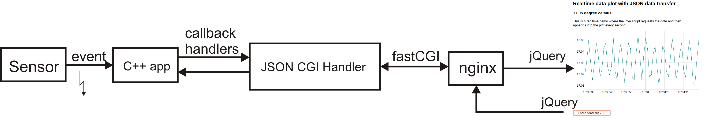

# jQuery <--> C++ fastcgi web API

C++ Header-only event driven communication between jQuery in a web-browser via nginx.

This was developed because of a lack of a lightweight jQuery to C++
communication. It's a small helper which can easily be
included in any C++ application which needs to talk to a web page
where realtime data needs to be exchanged.



## Prerequisites

```
apt-get install libfcgi-dev
apt-get install libcurl4-openssl-dev
```

## Installation

This is a pure header based libary. All the code is in `json_fastcgi_web_api.h`. Just type:
```
sudo make install json_fastcgi_web_api.h
```
to install the header in the system-wide include dir.

## Howto

The only file you need is:
```
json_fastcgi_web_api.h
```

The file `json_fastcgi_web_api.h` has extensive inline documentation. 
Its doxygen generated online documentation is here: 
https://berndporr.github.io/json_fastcgi_web_api/

### Implement the GET callback (server -> client)

This is the callback which sends JSON packets to the client (website, phone app, etc):

```
	class GETCallback {
	public:
		/**
		 * Needs to return the payload data sent to the web browser.
		 * Use the JSON generator class or an external json generator.
		 **/
		virtual std::string getJSONString() = 0;
	};
```
Overload `getJSONString()` and return JSON. You can use the
class `JSONGenerator` to generate the JSON data: Use the `add`
methods to add key/value pairs and then get the json with the
method `getJSON()`.

### Implement the POST callback (client -> server, optional)

This handler receives the JSON from jQuery POST command from the
website for example when the user presses a button. Implement the callback:

```
	class POSTCallback {
	public:
		/**
		 * Receives the data from the web browser in JSON format.
		 * Use postDecoder() to decode the JSON or use an external
		 * library.
		 **/
		virtual void postString(std::string arg) = 0;
	};
```
Overload `postString(std::string arg)` with a function
which decodes the received POST data.
Use:
```
postDecoder(std::string s)
```
which returns a `std::map` of key/value pairs.

### Start the communication

The constructor takes as arguments the GET callback, the POST callback
and the path to the fastCGI socket. As soon as the constructor is
instantiated the communication starts.

```
       /**
         * Constructor which inits it and starts the main thread.
         * Provide an instance of the callback handler which provides the
         * payload data in return. The optional socketpath variable
         * can be set to another path for the socket which talks to the
         * webserver. postCallback is the callback which returns
         * received json packets as a map.
         **/
        JSONCGIHandler(GETCallback* argGetCallback,
                       POSTCallback* argPostCallback = nullptr,
		       const char socketpath[] = "/tmp/fastcgisocket");
```

### Stop the communication

This is done by deleting the instance.


## Example code

### Fake sensor demo
The subdir `fake_sensor_demo` contains a `demo_sensor_server` which fakes a temperature sensor
and its readings are plotted in a web brower. The nginx
config file and the website are in the `website`
directory.

### Real ADC realtime demo
The subdir `ads1115_demo` contains a demo where the channel one from a real ADS1115 ADC chip is
plotted in a web browser. You need an ADS1115 ADC for this demo.


## Credit

Bernd Porr, mail@berndporr.me.uk
