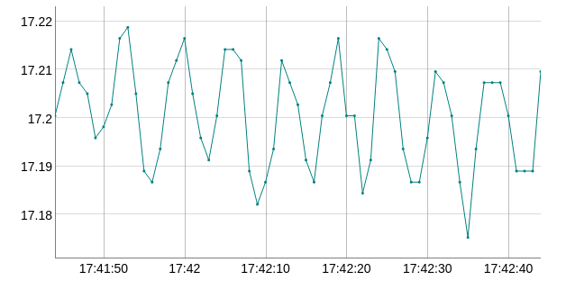

# json_fastcgi_web_api

Header-only JSON event driven communication between jQuery in browser and C++ via nginx


## Prerequisites

```
apt-get install libfcgi-dev
```

## Howto

### Implement the GET callback

This is the callback which sends JSON to the website:

```
	class GETCallback {
	public:
		/**
		 * Needs to return the payload data sent to the web browser.
		 * Use the JSON generator class or an external json generator.
		 **/
		virtual std::string getJSONString() = 0;
	};
```
Overload `getJSONString()` and return JSON. You can use the
class `JSONGenerator` for this purpose.

### Implement the POST callback (optional)

This handler receives JSON from the website for example
a button press. Implement the callback:

```
	class POSTCallback {
	public:
		/**
		 * Receives the data from the web browser in JSON format.
		 * Use jsonDecoder() to decode the JSON or use an external
		 * library.
		 **/
		virtual void postJSONString(std::string json) = 0;
	};
```
Overload `postJSONString(std::string json)` with a funcion
which decodes the received JSON. You can use `jsonDecoder(std::string s)` which returns a `std::map` of key/value pairs.

### Start communcation

The constructor takes as arguments the GET callback, the
path to the fastCGI socket and the POST callback. As
soon as the constructor is instantiated the communication
starts.

### Stop the communication

This is done by deleting the instance.


## Example code

The `demo_sensor_server` fakes a temperature sensor
and this is plotted on the screen. The nginx
config file and the website are in the `website`
directory.

Start `demo_sensor_server`
in the background with:
```
nohup ./demo_sensor_server &
```
which creates a socket under `\tmp\adc7705socket` to communicates with
the fastcgi server.

### Configuring the nginx for FastCGI

 1. copy the the nginx config file `website/nginx-sites-enabled-default` to your
    nginx config directory `/etc/nginx/sites-enabled/default`.
 2. copy `website/index.html` to `/var/www/html`.
 
Then point your web-browser to your webserver. You should see a fake
temperatue reading on the screen and a plot with dygraph.



