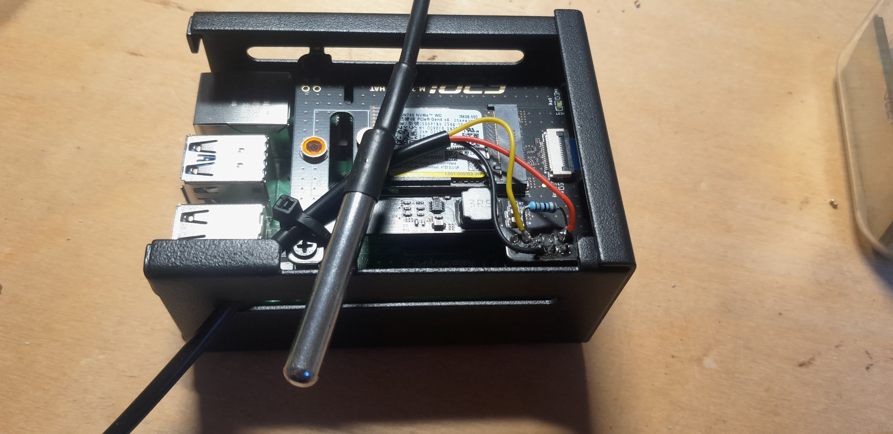
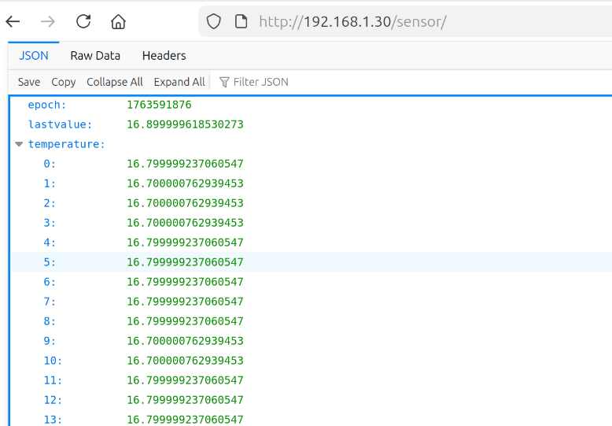

# DS18B20 temperature sensor server on the Raspberry PI



This is a web server plugin for the webserver nginx 
which provides temperature readings
in JSON format which are then plotted in the browser with the
javascript dataplotter Dygraphs: https://dygraphs.com/


## Hardware setup

Connect the sensor to GPIO4, 3.3V and GND on the raspberry pi:
https://pinout.xyz/pinout/1_wire
You need to use a pullup between GPIO and 3.3 of 1k-4.7k. See photo above.

Add to `/boot/firmware/config.txt`:

```
dtoverlay=w1-gpio
```
and reboot.

Check that you have a device similar to:
```
/sys/bus/w1/devices/28-3ce1e380ac02/temperature
```
note this for below when starting the server.

## Configuring the nginx for FastCGI

 1. copy the the nginx config file `website/nginx-sites-enabled-default` to your
    nginx config directory `/etc/nginx/sites-enabled/default`.
 2. copy `website/index.html` to `/var/www/html`.
 
## Running the fast CGI server
The fast cgi server `ds18b20_server` creates a socket under
`/tmp/sensorsocket` to communicate with nginx.

 1. For testing purposes in the foreground you can directly run the fastcgi server with, for example:
 ```
 ./ds18b20_server /sys/bus/w1/devices/28-3ce1e380ac02/temperature
 ```
 Replace `28-3ce1e380ac02` with your sensor ID. Every sensor has its unique ID.

 2. For production use in the background run, for example:
 ```
 nohup ./ds18b20_server /sys/bus/w1/devices/28-3ce1e380ac02/temperature &
 ```

## Viewing the temperature plot
Point your web-browser to your website.
You should see a temperature reading on the screen and a plot with dygraph.
The JSON packets can be viewed by appending `/sensor/` to the server URL.


