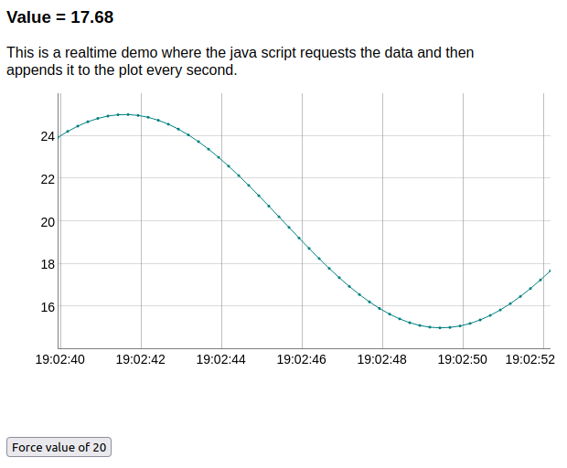

# Fake sensor demo

## Running the fast CGI server
The fast cgi server `demo_sensor_server` creates a socket under
`/tmp/sensorsocket` to communicate with nginx.

 1. For testing purposes in the foreground you can directly run the fastcgi server with
 ```
 ./demo_sensor_server
 ```

 2. For production use in the background run:
 ```
 nohup ./demo_sensor_server &
 ```

## Configuring the nginx for FastCGI

 1. copy the the nginx config file `website/nginx-sites-enabled-default` to your
    nginx config directory `/etc/nginx/sites-enabled/default`.
 2. copy `website/fakesensor.html` to `/var/www/html`.
 
Then point your web-browser to `fakesensor.html` on your website.
You should see a fake temperatue reading on the screen and a plot with dygraph.
The JSON packets can be viewed by appending `/sensor/` to the server URL.

The script sends also a JSON packet to the demo server which
requests to clamp the temperature to 20C and prints out a string
to stderr.


