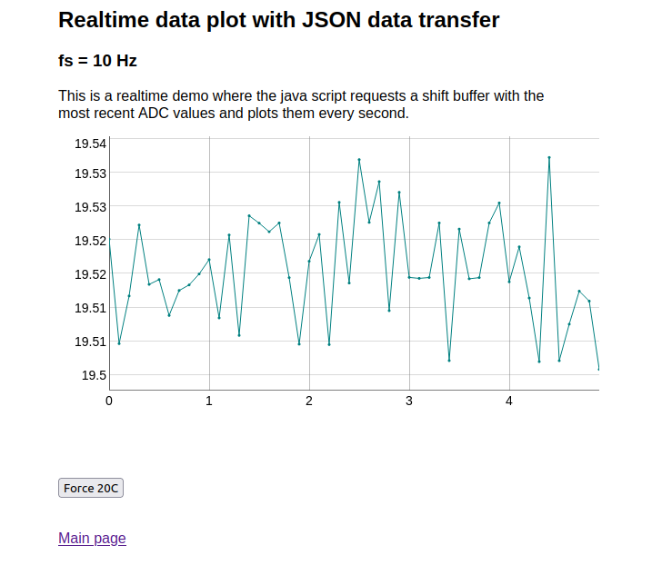

# USBDUX ADC demo with LM35 temperature sensor



This is a demo with the USBDUX-sigma or USBDUX-D which displays
channel 0 at a sampling rate of 10Hz on a website.

Please connect an LM35 temperature sensor to the
analogue input 0.

## Prerequisites

Install the COMEDI drivers for the Raspberry PI from here:
```
https://github.com/glasgowneuro/comedi_raspberry_pi_bullseye
```
and the userspace libcomedi and the json library:

```
apt install libcomedi-dev libjsoncpp-dev
```

## Compilation

Just run:
```
cmake .
make
```

## Running the fast CGI server
The fast cgi server `usbdux_server` creates a socket under
`/tmp/sensorsocket` to communicate with nginx.

 1. For testing purposes in the foreground you can directly run the fastcgi server with
 ```
 ./usbdux_server
 ```

 2. For production use in the background run:
 ```
 nohup ./usbdux_server &
 ```

## Configuring the nginx for FastCGI

 1. copy the the nginx config file `website/nginx-sites-enabled-default` to your
    nginx config directory `/etc/nginx/sites-enabled/default`.
 2. copy `website/usbdux.html` to `/var/www/html`.
 
Then point your web-browser to on your website.
You should see the ADC readings on the screen and a plot with dygraph.
The JSON packets can be viewed by appending `/sensor/` to the server URL.

The script sends also a JSON packet to the demo server which
requests to clamp the ADC value to 0 and prints out a string
to stderr.
